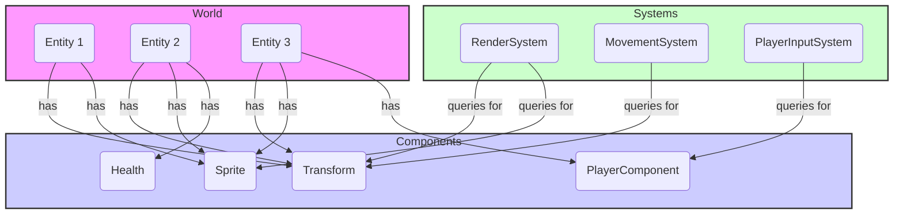

# Architecture Overview

This document provides a high-level overview of the project's architecture. The design is based on the **Entity-Component-System (ECS)** pattern, chosen for its ability to promote clean separation of concerns, enhance performance, and improve modularity.

The project is divided into two primary packages:
- `september.engine`: Provides the generic, reusable core of the engine (ECS, rendering, input).
- `september.game`: Contains the specific implementation of the game, including its unique components, systems, and logic.

---

## 1. Core Concepts: Entity-Component-System (ECS)

ECS is a design pattern that favors composition over inheritance. Instead of creating deep class hierarchies, we build objects (**Entities**) by attaching modular, reusable data containers (**Components**). Logic is then implemented in **Systems**, which run independently of the data they process.

### 1.1. The Parts

- **Entity**: An entity is just a unique ID. It has no data or behavior of its own. It acts as a key that associates a group of components together.

- **Component**: A component is a plain data object (a Java `record` or simple class) that stores a single aspect of an object. For example, an entity might have a `TransformComponent` (for position) and a `SpriteComponent` (for appearance). Components contain data, not logic.

- **System**: A system contains all the logic for a specific domain, such as rendering, physics, or AI. It operates on all entities that have a particular set of components. For example, the `MovementSystem` would query for all entities that have both a `TransformComponent` and a `ControllableComponent` and update their positions.

- **World**: The world is the central container that manages all entities, components, and systems. It provides methods for creating and destroying entities, adding and removing components, and retrieving entities based on their components.

### 1.2. Architectural Diagram

The following diagram illustrates the relationship between these core concepts. The `World` manages the lifecycle of `Entities`. Each `Entity` is a lightweight identifier that "points" to a collection of `Components` (some from the engine, some from the game). `Systems` query the `World` for entities that match a specific component signature and then execute their logic on them.



---

## 2. The Game Loop

The engine's main loop orchestrates the flow of data and logic between systems. On each frame, the `Engine` performs the following steps in order:

1.  **Poll Input**: Gathers all input events (keyboard, mouse, etc.) from the underlying windowing system (GLFW).
2.  **Update Systems**: Executes the `update()` method on each registered system. This is where all game logic happens.
3.  **Swap Buffers**: Presents the newly rendered frame to the user. The `RenderSystem` is responsible for drawing the world state during the `update()` phase.

---

## 3. Separation of Engine and Game

A key architectural goal is the strict separation between the generic `engine` and the specific `game` logic. The engine must not have any dependencies on the game.

### `september.engine`

- **Purpose**: To provide a reusable, application-agnostic foundation for building games.
- **Contents**:
    - The core ECS classes (`World`, `Component`, `ISystem`).
    - Common components (`TransformComponent`, `ControllableComponent`, `SpriteComponent`, `MovementStatsComponent`, `ColliderComponent`).
    - Rendering abstractions (`Renderer`, `Mesh`, `Texture`, `Camera`).
    - Input abstractions (`InputService`).
    - Core systems (`RenderSystem`, `MovementSystem`).

### `september.game`

- **Purpose**: To define the actual gameplay by extending the engine.
- **Contents**:
    - The `Main` class that assembles and runs the engine.
    - Game-specific components (`PlayerComponent`, `EnemyComponent`, `HealthComponent`).
    - Game-specific systems (`PlayerInputSystem`, `EnemyAISystem`, `CollisionSystem`).
    - Mappings for input (`GameAction`, `InputMappingService`).

### Extensibility Pattern: The `ColliderType` Example

To maintain this strict separation, the engine uses interfaces to allow the game to provide specific implementations.

1.  **Engine Defines an Interface**: The engine's `ColliderComponent` contains a generic `ColliderType` marker interface.
    ```java
    // In september.engine.ecs.components.ColliderComponent
    public interface ColliderType {}
    private final ColliderType type;
    ```

2.  **Game Implements the Interface**: The game creates a concrete `enum` of its specific types that implements the engine's interface.
    ```java
    // In september.game.components.GameColliderType
    public enum GameColliderType implements ColliderComponent.ColliderType {
        PLAYER, WALL, ENEMY
    }
    ```

3.  **Game System Uses the Implementation**: The game's `CollisionSystem` contains the logic that references the specific `GameColliderType` enum.

This pattern allows the engine to remain completely generic while giving the game the power to define its own specific types and behaviors.

---

## 4. Directory Structure

The source code is organized as follows:

- `src/main/java/september/engine/`: Reusable engine code.
    - `core/`: The main `Engine` class, windowing, and the game loop.
    - `ecs/`: The core interfaces and classes for the ECS pattern.
        - `components/`: Generic, reusable components.
    - `rendering/`: Rendering abstractions and the OpenGL implementation.
    - `assets/`: Asset loading and management.
    - `systems/`: Common, engine-level systems.

- `src/main/java/september/game/`: Game-specific implementation.
    - `components/`: Components that define the game's objects and rules.
    - `systems/`: Systems that implement the game's logic.
    - `input/`: Input action definitions and mappings.
