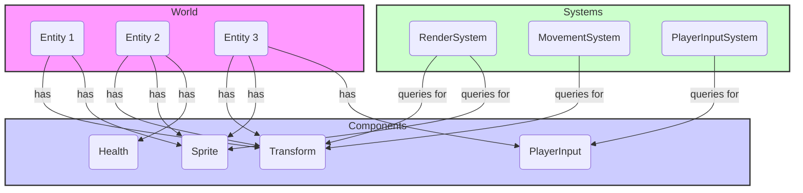
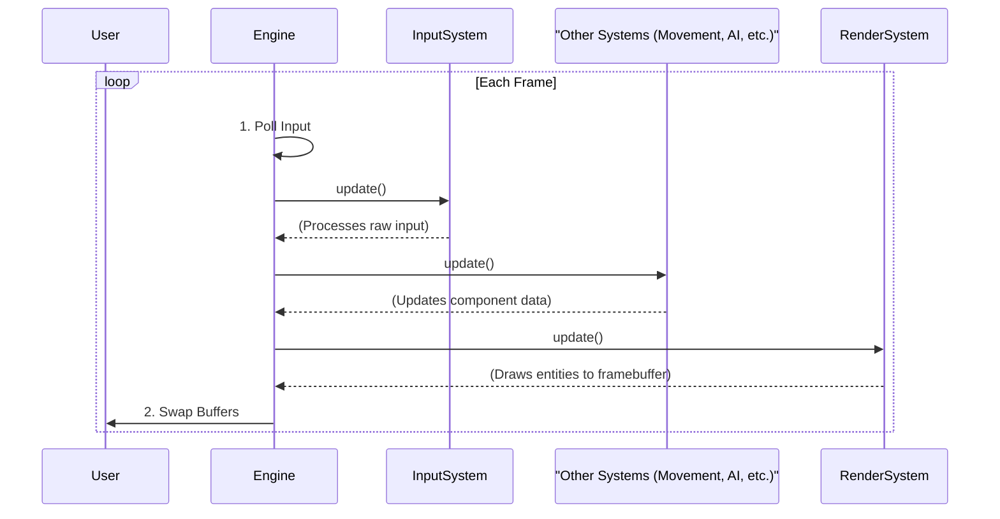

# Architecture Overview

This document provides a high-level overview of the project's architecture. The design is based on the **Entity-Component-System (ECS)** pattern, chosen for its ability to promote clean separation of concerns, enhance performance, and improve modularity.

The engine is divided into two primary packages:
- `september.engine`: Provides the generic, reusable core of the engine (ECS, rendering, input).
- `september.game`: Contains the specific implementation of the game, including its unique components, systems, and logic.

---

## 1. Core Concepts: Entity-Component-System (ECS)

ECS is a design pattern that favors composition over inheritance. Instead of creating deep class hierarchies, we build objects (**Entities**) by attaching modular, reusable data containers (**Components**). Logic is then implemented in **Systems**, which run independently of the data they process.

### 1.1. The Parts

- **Entity**: An entity is just a unique ID. It has no data or behavior of its own. It acts as a key that associates a group of components together.

- **Component**: A component is a plain data object (a Java `record` or simple class) that stores a single aspect of an object. For example, an entity might have a `TransformComponent` (for position) and a `SpriteComponent` (for appearance). Components contain data, not logic.

- **System**: A system contains all the logic for a specific domain, such as rendering, physics, or AI. It operates on all entities that have a particular set of components. For example, the `MovementSystem` would query for all entities that have both a `TransformComponent` and a `MovementStatsComponent` and update their positions.

- **World**: The world is the central container that manages all entities, components, and systems. It provides methods for creating and destroying entities, adding and removing components, and retrieving entities based on their components.

### 1.2. Architectural Diagram

The following diagram illustrates the relationship between these core concepts. The `World` manages the lifecycle of `Entities`. Each `Entity` is a lightweight identifier that "points" to a collection of `Components`. `Systems` query the `World` for entities that match a specific component signature and then execute their logic on them.

---

## 2. The Game Loop

The engine's main loop orchestrates the flow of data and logic between systems. The loop is designed to be deterministic and testable, driven by the `MainLoopPolicy` API.

On each frame, the `Engine` performs the following steps in order:

1.  **Poll Input**: Gathers all input events (keyboard, mouse, etc.) from the underlying windowing system (GLFW).
2.  **Process Systems**: Executes the `update()` method on each registered system. This is where all game logic happens.
3.  **Render**: Executes the `RenderSystem` to draw the current state of the world to the screen.
4.  **Swap Buffers**: Presents the newly rendered frame to the user.

### 2.1. Game Loop Flowchart

This diagram shows the sequence of events during a single pass of the game loop.

---

## 3. Separation of Engine and Game

A key architectural goal is the strict separation between the generic `engine` and the specific `game` logic.

### `september.engine`

- **Purpose**: To provide a reusable, application-agnostic foundation for building games.
- **Contents**:
    - The core ECS classes (`World`, `Component`, `ISystem`).
    - Common components (`TransformComponent`).
    - Rendering abstractions (`Renderer`, `Mesh`, `Texture`).
    - Input abstractions (`InputService`).
    - Core systems (`RenderSystem`).

### `september.game`

- **Purpose**: To define the actual gameplay.
- **Contents**:
    - The `Main` class that assembles and runs the engine.
    - Game-specific components (`PlayerComponent`, `HealthComponent`).
    - Game-specific systems (`PlayerInputSystem`, `EnemyAISystem`).
    - Mappings for input (`GameInputMapping`).
    - All game assets (textures, sounds, etc.) are located in the `resources` folder.

This separation allows the engine to be developed and improved independently of the game. It also means the engine could be reused to create an entirely different game by simply swapping out the `september.game` package.

---

## 4. Directory Structure

The source code is organized as follows:

- `src/main/java/september/engine/`: Reusable engine code.
    - `core/`: The main `Engine` class, windowing, and the game loop.
    - `ecs/`: The core interfaces and classes for the ECS pattern.
    - `rendering/`: Rendering abstractions and the OpenGL implementation.
    - `assets/`: Asset loading and management.
    - `systems/`: Common, engine-level systems.

- `src/main/java/september/game/`: Game-specific implementation.
    - `components/`: Components that define the game's objects.
    - `systems/`: Systems that implement the game's logic.
    - `input/`: Input action definitions and mappings.
