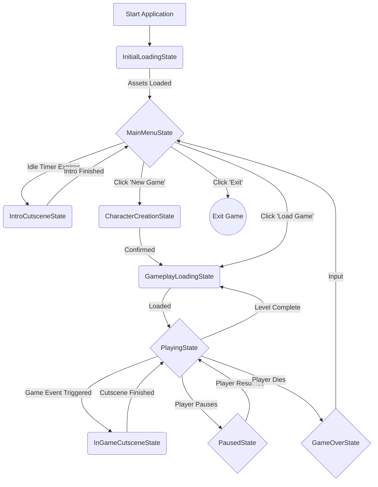
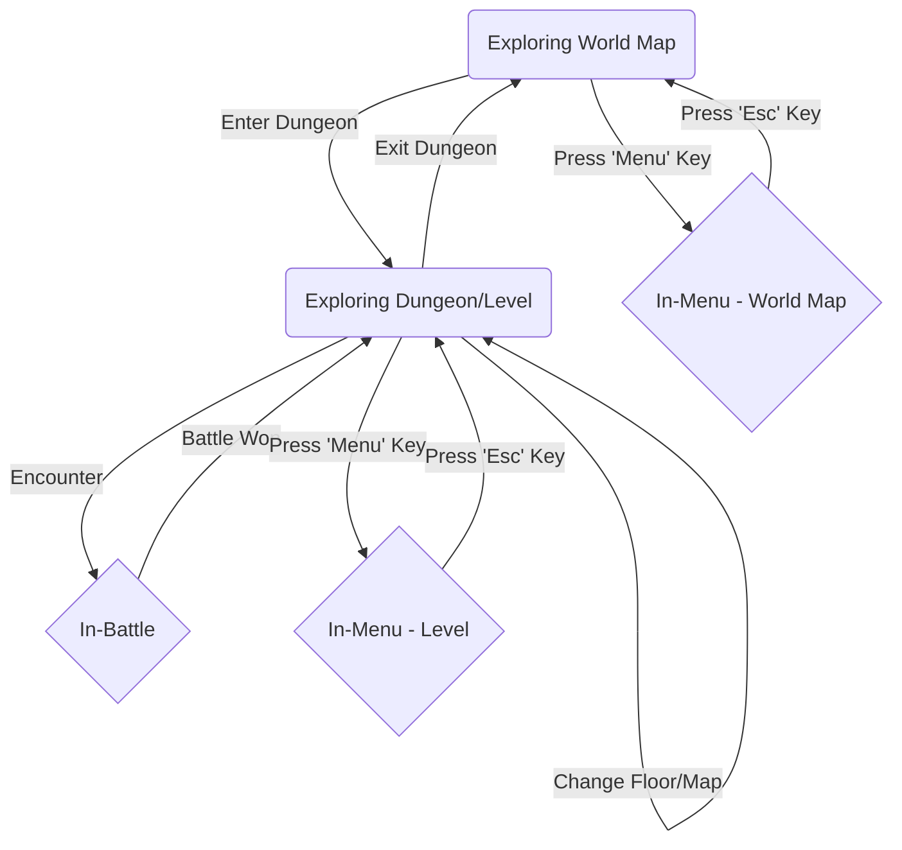

Of course. Here is the detailed architectural design document for the State and Scene Management systems. This document is intended to be the single source of truth for this architecture, ensuring that as the project grows, we adhere to these core principles of creating a clean, scalable, and maintainable game.

-----

# Game Architecture: State and Scene Management

## 1\. Core Philosophy

This document outlines the architecture for managing the application's flow (`Game States`) and the content of the game world (`Scenes`). Our primary goal is to create a system that is robust, scalable, and highly decoupled, enabling complex gameplay mechanics similar to those found in classic RPGs like *Final Fantasy*, *The Legend of Zelda*, and *Chrono Trigger*.

The core principle of this architecture is the strict **separation of concerns between behavior and data**:

* **Game States (Behavior):** A `State` is a class that defines **what the game is *doing***. It controls which systems are active, how player input is interpreted, and what the high-level application flow is (e.g., being in a menu vs. playing the game).
* **Scenes (Data):** A `Scene` is a data-only asset (e.g., a JSON file) that describes **what is *in* the world**. It is a blueprint for a collection of entities and their components, defining a level, a menu screen, or a cutscene environment.

This separation allows us to reuse behavioral states across many different data-driven scenes, which is the key to building a large and complex game without creating a tangled, unmaintainable codebase.

## 2\. The Hierarchical State Machine

To manage the complexity of a modern game, we will use a **Hierarchical State Machine (HSM)**. This architecture is composed of two primary levels:

1.  **The Main Application FSM:** A global, stack-based Finite State Machine that manages the high-level application flow.
2.  **Internal Sub-State FSMs:** Simpler state machines that live *inside* a primary state (like `PlayingState`) to manage different modes of interaction within that state.

### 2.1. Main Application State Flow

This FSM controls the overall game, transitioning between major contexts like menus, loading screens, and active gameplay. It is implemented as a stack, which allows us to "push" temporary states (like `PausedState` or a `MiniGameState`) on top of the current state and then "pop" them to seamlessly return to the previous context.

#### Primary States and Transitions:



#### Key State Responsibilities:

* **`InitialLoadingState`**: A lightweight entry point that loads only the essential assets for the main menu to ensure a fast startup. Transitions immediately to `MainMenuState`.
* **`MainMenuState`**: The central hub. Manages UI input, an idle timer for an attract-mode cutscene, and initiates transitions to start or load a game. This state loads the `main_menu.scene` for its visual elements.
* **`CharacterCreationState`**: A UI-heavy state for when a player starts a "New Game." It collects player choices (name, difficulty, etc.) before transitioning to the `GameplayLoadingState`.
* **`GameplayLoadingState`**: A powerful and reusable state that handles the loading of all playable scenes (levels, world maps, etc.). It clears the `IWorld`, loads new assets, populates the world from a scene file, and (if applicable) applies saved game data.
* **`PlayingState`**: The most important state. This is the container for all active gameplay. It runs the core game logic and contains its own internal state machine (see section 2.2).
* **`PausedState`**: A global, modal state. When pushed onto the stack, it freezes all active gameplay systems. When popped, gameplay resumes exactly where it left off.
* **`InGameCutsceneState` / `IntroCutsceneState`**: States pushed onto the stack to play narrative sequences. They disable most player input and run specialized animation or scripting systems.
* **`GameOverState`**: A simple state that displays the "Game Over" screen and waits for input to return to the `MainMenuState`.

### 2.2. `PlayingState` Internal Sub-States

To avoid making the main FSM overly complex, the `PlayingState` manages its own internal FSM. This machine handles the different *modes* of interaction while the player is actively in the game world. This is what allows the game to feel fluid, moving between exploration, combat, and menus without changing the main application state.

#### Internal States and Transitions:



#### Key Sub-State Responsibilities:

* **`Exploring World Map` / `Exploring Dungeon/Level`**: These are the default modes of play. They run all core gameplay systems (physics, AI, player input). The distinction allows for different rules, such as random encounters only occurring in dungeons. Transitions between these are handled as in-world actions (e.g., walking into a cave), which trigger a request to the main FSM's `GameplayLoadingState` to load the new scene.
* **`In-Battle`**: This sub-state is triggered by an encounter. It deactivates exploration systems and activates battle systems (e.g., turn-based logic, command input). This is the classic JRPG "battle transition" model found in *Final Fantasy*.
* **`In-Menu`**: This sub-state is entered when the player opens their inventory, status screen, etc. It pauses the active exploration systems and hands control over to the `UISystem`, effectively freezing the world while the player manages their party.

## 3\. Scene Management and Serialization

* **Scene Manager:** A dedicated service (`SceneManager`) will be responsible for parsing scene files and populating the `IWorld`. A `State` (like `LoadingState`) will command the `SceneManager` to perform its work.
* **Serialization Format:** We will use **JSON** for scene files. It is human-readable, which is invaluable for debugging and hand-editing levels, and it is easily parsed by many libraries.
* **Scene File Content:** A scene file is a list of entity "prefabs" or templates. Each template defines the set of components that should be attached to a newly created entity.
  * **Example (`level_1.json` excerpt):**
    ```json
    {
      "sceneName": "Forest Path",
      "entities": [
        {
          "name": "PlayerStart",
          "components": {
            "TransformComponent": { "position": [10.5, 0.0, 25.0] }
          }
        },
        {
          "name": "EnemyGoblin_1",
          "components": {
            "TransformComponent": { "position": [15.0, 0.0, 30.0] },
            "SpriteComponent": { "textureHandle": "goblin_sprite" },
            "HealthComponent": { "maxHealth": 50 },
            "EnemyComponent": {}
          }
        }
      ]
    }
    ```

## 4\. Save/Load System

The save/load system is distinct from the scene system. A scene describes the *initial*, pristine state of a level. A save file describes the *current*, modified state of the game world.

* **Save Data:** A save file will contain:
  * The ID of the player's current scene (e.g., "world\_map.json").
  * The complete state of all dynamic entities (player, NPCs, enemies), including their current position, health, and inventory.
  * Global game flags (e.g., story events completed, chests opened).
* **Loading Process:** When the `GameplayLoadingState` is triggered by a "Load Game" request, it will:
  1.  Load the scene file specified in the save data (`world_map.json`). This recreates the pristine version of the level.
  2.  Iterate through the entity data in the save file and *overwrite* the components of the newly created entities with the saved values. This restores the world to its exact previous state.

This two-step process ensures that the static level geometry and the dynamic character data are correctly restored.
